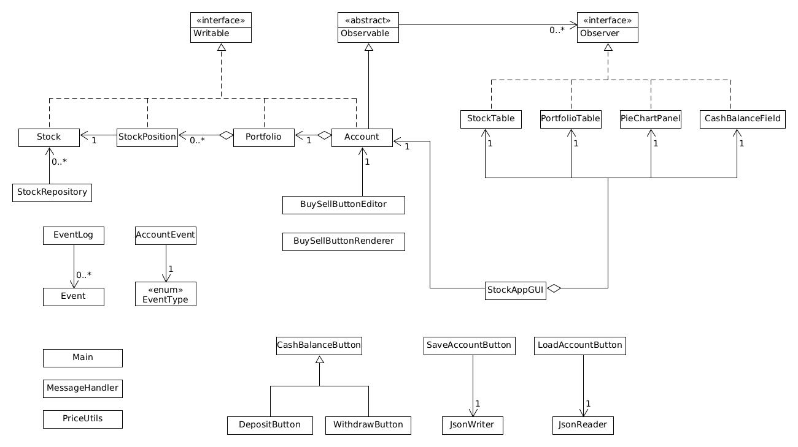

# Stock Position Tracker and Picker

## Objective
**Stock Position Tracker and Picker** application is designed to help users manage and analyze their investment portfolios

### What?

The application will allow users to add, update, and remove stock positions, track the current value of their holdings, and save or load their portfolio state for continued analysis. Additionally, the app will feature a stock-picking algorithm that suggests potential investments.

### Who?

This app is intended for *individual investors* and *financial enthusiasts* who want a simple tool to manage their stock portfolios and make decisions about potential investments.

### Why?

This app provides me with an opportunity to explore financial data processing and develop an algorithmic approach to stock selection, areas that are both intellectually stimulating and practically relevant to anyone interested in finance and technology.

## User Stories

- As a user, I want to be able to deposit or withdraw cash to/from my portfolio
- As a user, I want to be able to add a stock to my portfolio
- As a user, I want to be able to see list of stocks in my portfolio
- As a user, I want to be able to remove a stock from my portfolio
- As a user, I want to be able to update the quantity or average cost of a stock when I buy/sell that stock
- As a user, I want to see a summary of my portfolio's overall performance, including metrics like total value, total profit/loss, and percentage change
- As a user, I want to save my entire portfolio to file
- As a user, I want to load my entire portfolio from file

## Intructions for End User

- You can generate the first required action related to the user story "adding multiple stocks to portfolio" by selecting Buy button on specific's stock row on Stocks panel or Portfolio panel.
- You can generate the second required action related to the user story "removing multiple stocks from portfolio" by selecting Sell button on specific's stock row on Stocks panel or Portfolio panel.
- You can deposit cash by selecting Deposit button on Account panel.
- You can withdraw cash by selecting Withdraw button on Acccount panel.
- You can locate my visual component (cash and stock distribution pie chart) by navigating to Account panel.
- You can save the state of my application by selecting Save button on Account panel.
- You can reload the state of my application by selecting Load button on Account panel.

## Event logs
The event logs are stored whenever user buys & sells stocks, and deposits & withdraws cash. All logs are printed to console when the GUI window is closed.

Example of event logs:
```
Wed Nov 27 12:42:21 PST 2024
Deposited $2000.0
Wed Nov 27 12:42:30 PST 2024
Bought 4 shares of ADSK
Wed Nov 27 12:42:39 PST 2024
Bought 6 shares of BRK-B
Wed Nov 27 12:42:53 PST 2024
Sold 2 shares of ADSK
Wed Nov 27 12:43:00 PST 2024
Sold 1 share of BRK-B
Wed Nov 27 12:43:08 PST 2024
Withdrew $1000.0
```

#### UML Design Diagram 


#### Refactoring Possibilities
-  `StockTable` and `PortfolioTable` to have same interface/abstract class since they have same columns containgin stock symbol and buy/sell buttons.
- All the `Button` components can also share the same interface/abstract class to display same behavior when user selects them.
- The Panels used to construct the GUI are currently intialized directly in the GUI, which can be done better by using separate classes for different components.
- Also, the Observer class currently has GUI components as their concrete observers, so this can be improved by only having the specific Swing components that need to be updated so that all of the panel doesn't need to repainted.
